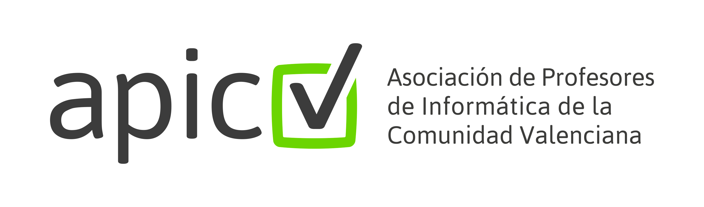

## Prueba de concepto

Versión alternativa y estática de la web de la APICV

- [ ] Configurar Lektor (generador de sitios estáticos, multiidioma, muy flexible)
- [ ] Configurar despliegue automático (Travis-CI)
- [ ] Selección y creación de plantilla
- [ ] Volcado de contenidos
- [ ] Traducción al valenciano
